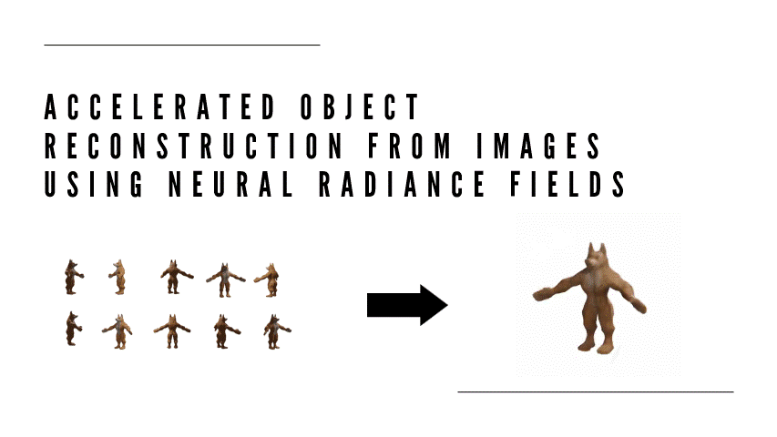
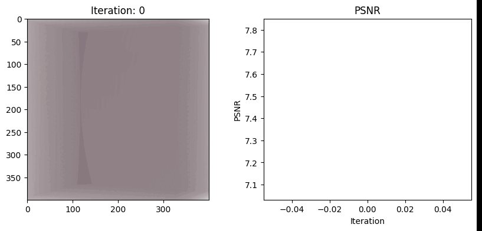

# Instant Neural Radiance Fields - Reimplementation in PyTorch

This repository contains a PyTorch implementation of a NERF model with acclearated training time ". It includes a case study involving the following papers

Plenoxels, Radiance Fields without Neural Networks by Yu and Fridovich-Keil et al

Neural Geometric Level of Detail: Real-time Rendering with Implicit 3D Shapes by Takikawa et al., 2021

Instant Neural Graphics Primitives with a Multiresolution Hash Encoding" by Müller et al


## Introduction




## Running 


In Google Collab  copy the following cells : 

```bash
!git clone https://github.com/AmrMohamedSharaf/instantNuralFields-Reimplementation-Pytorch-.git
%cd instantNuralFields-Reimplementation-Pytorch-
!pip install -r requirements.txt
```
```bash
from nerf.create_model import create_model
from nerf.utils import setup_data_loaders
from nerf.model_trainer import NerfTrainRunner
from nerf.eval import eval
````


Adjust the parameters (These are the ones used in the demo videos):

```bash
L = 4
near = 8
far = 12
nb_epochs = 1
lr = 1e-3
gamma = 0.5
nb_bins = 100
base_lod = 4
num_lod = 3
batch_size = 10240
data_path = #PATH TO YOUR DATA 


model_params = {
    "L": L,
    "near": near,
    "far": far,
    "nb_epochs": nb_epochs,
    "lr": lr,
    "gamma": gamma,
    "nb_bins": nb_bins,
    'base_lod': base_lod,
    'num_lod': num_lod,
    'batch_size': batch_size
  }
````

Select the model type:

```bash
model_types = ['plenoxels' ,'nglod' , 'mlp' , 'hash']
model , optimizer , scheduler = create_model( model_types[#your Index here] ,model_params )
````

Load the data :

```bash
dataloader , dataloader_warmup ,test_data = setup_data_loaders(data_path, batch_size)
test_o, test_d, test_px = test_data

````

Train  (The demo was train on T4 GPU)
```bash
trainer = NerfTrainRunner(model, optimizer, scheduler, near, far, nb_bins, nb_epochs, dataloader,
                          test_o[0], test_d[0],test_px[0] ,batch_size, checkpoints_path = None)
trainer.run()
````

## Presentation


 360 video:

```bash
eval(model , test_o[6] , test_d[6])
````
