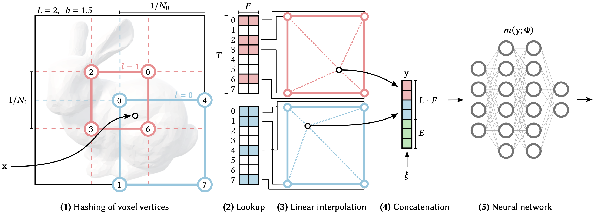
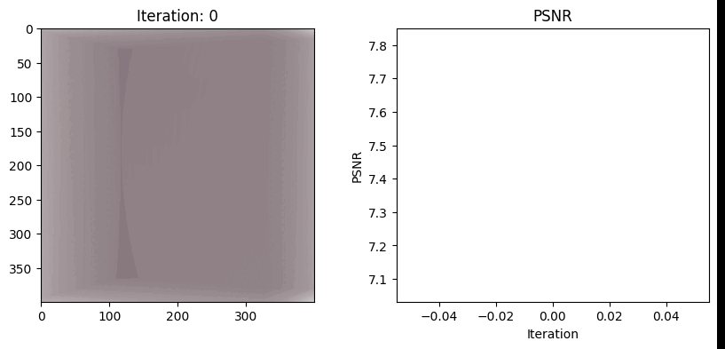
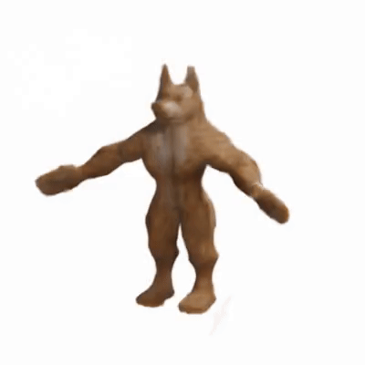

# Instant Neural Fields - Reimplementation in PyTorch

This repository contains a PyTorch reimplementation of the paper "Instant Neural Graphics Primitives with a Multiresolution Hash Encoding" by Müller et al.

  
*Figure 1: Instant Neural Fields illustration.*

  
*Figure 2: Training results after 1400 epochs.*

  
*Figure 3: Novel Views.*

## Run the notebook in Collab 

